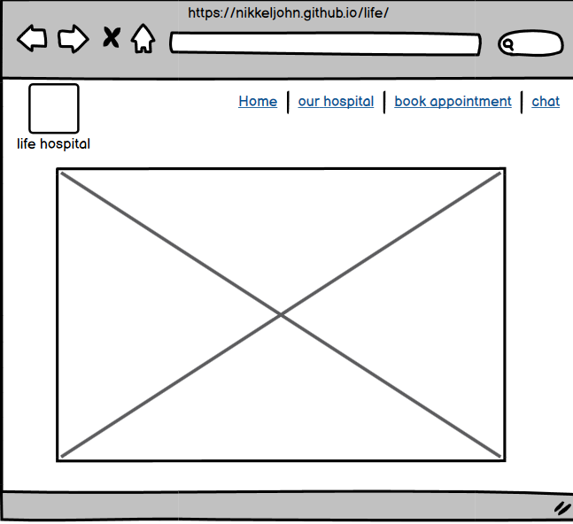

   # Life Hospital
Welcome to the life hospital website! This website helps the user to interact with hospitals and book appointments for their check-up. Life  Institute of Medical Sciences Europe Ltd (LIFE), the well-acclaimed health enterprise and one of the leading healthcare systems in Ireland, assures comprehensive health care services with a global standard. The 600-bedded multispecialty hospital is renowned for its excellent medical expertise,  nursing care, and quality diagnostic services. By focusing on the idea of a caring mission with a global vision,  Life, one of the best hospitals in Ireland,  stresses improving the community's health by setting up a standard of excellence in medical education, research, and clinical care. Aiming for patient-centric care, the hospital is utilizing enhanced lifesaving technologies for leveraging the level of cure. View the live site

 [Here](https://nikkeljohn.github.io/life/)


<h2><b>FEATURES</b></h2>
<h2>website</h2>

## Navigation bar

<p>This navigation provide the major access to  the website such as booking appointment, there is a medium for us to chat within the website so we can ask our questions and there are two more buttons that allow us to navigate through the home, hospital details, and chat box </p> 
<h2>Footer</h2>
<p>Here we have given four dedicated social media buttons with an icon to each button so the user won't have any problem identifying them, to access them we have to login into each and every website we press and we can access our social media platform and like and subscribe them for future updates, and news</p>


<h2>Favicon</h2>
<p>A favicon is added so it will provide an image in the tabs header to allow the user to easily identify the website if they have multiple tabs open, and the doctor's emblem was given for the life hospital website for more eye appealing and identifying while lots of other tabs are open</p>


<h2>Chat and Booking appointment</h2>
<h3>Chat</h3>


<p>A chat box is created for questions so we can ask to help center and after completing all required tasks  accurately and pressing send it will take us to a new window where a message shows up  "message was received and thank you"  <p>


<h2>Booking Appointment</h2>
<p>A booking page is created, we are required to enter your email id, name, and number then only we can book an appointment, if any information is missing from the tab a pop-up message will come to remind the user to fill it </p>


After booking then we were directed to another page where it says thanks for booking 


<h3>CLICK HERE</h3>  Click is provided on both thank you pages so the user can go back to the home page faster!


<h2>Our Hospitals</h2>
Here we have all our hospital images which are located all over the world, and a discription about the hospital is given


<h2>Life</h2> Centres of Excellence
LIFE HOSPITAL gives world-class, Centres of Excellence (COE) are an amalgamation of experienced doctors, state-of-the-art technology, and the highest level of patient care and treatment. Our CEOs ensure that every aspect of your care is seamless and the team of experts works together to provide the care you need.

<b>Our COE = Best Clinical Experts + Latest Technology + Exceptional Patient Experience</b>
<h2>Existing Features</h2>

* Interactive home page
* Gallery page which is obtained from clicking 'Our Hospital'
* Booking form and thanks page for that
* Chat page and its thank you page

<h2>Features Left to Implement</h2>
<ul>
<li>More hero images and animation</li>
<li>A compliant form </li>
<li>A more intractive booking tab so a user can choose which doctor or department they want</li>

<h1>Design</h1>
<hr>
<h2>Wireframes</h2>
<h3>Home page<h3>


<h3>chat page <h3>


<p>
<h3>Book Appointment</h3>


</p>

<p>
booking conformation page


</p>

our hospitals
<p>




<h1>Technologies</h1>

 HTML
- The structure of the Website was developed using HTML as the main language.

 CSS

- The Website was styled using custom CSS in an external file.
 
 Gitpod

- The website was developed using gitpod
 
 GitHub
- Source code is done on GitHub and deployed using Git Pages.
 
 Git
- Used to commit and push code during the development of the Website
 
 Font Awesome
- Icons obtained from https://fontawesome.com/ were used as the Social media links in the footer section.

Tinyjpg
- https://tinyjpg.com/ was used to reduce the size of the images used throughout the website
 
 Favicon.io
- favicon files were created at https://favicon.io/favicon-converter/
 
 Balsamiq
- wireframes were created using Balsamiq from https://balsamiq.com/wireframes/desktop/#


<h2>Testing</h2>

Responsiveness

All pages were tested to ensure responsiveness on screen sizes from 360px and upwards as defined in WCAG 2.1 Reflow criteria for responsive design on Chrome, Edge, Firefox, and Opera browsers. 

Steps to test: 

Open the browser and navigate to the lifespan of the developer tools (right click and inspect)Set to responsive and decrease width to 320pxSet the zoom to 50%Click and drag the responsive window to maximum width expected: Website is responsive on all screen sizes and no images are pixelated or stretched. No elements overlap. 

Actual: The website was also opened on the following devices and no responsive issues were seen: 

Samsung galaxy s22

oneplus

i phone

## Accessibility

Wave Accessibility tool was used throughout the development and for the final testing of the deployed website to check for any aid accessibility testing. 

Testing was focused to ensure the following criteria were met:

All forms have associated labels or aria-labels so that this is read out on a screen reader to users who tab to form inputsColor contrasts meet a minimum ratio as specified in WCAG 2.1 Contrast GuidelinesHeading levels are not missed or skipped to ensure the importance of content is relayed correctly to the end user content is contained within landmarks to ensure ease of use for assistive technology, allowing the user to navigate by page regions, not textual content had alternative text or titles so descriptions are read out to screen renders 

HTML page lang attribute has been Setaria properties have been implemented correctlyWCAG 2.1 Coding best practices being followedManual tests were also performed to ensure the website was accessible as possible and an accessibility 
issue was identified.

Issue was found but resolved 

HTML code validator showed no errors in every page 


CSS code validator also came error free


## Light house testing

### Functional Testing

**Navigation Links**

Testing was performed to ensure all navigation links on the respective pages, navigated to the correct pages as per design. This was done by clicking on the navigation links on each page.


|Navigation link   | page to load       |
| ---------------- | ------------------ |
| Home             | Home page          |
| Our Hospitals    |  ourhospital.html  |
| Chat             | contact.html       |
| Booking          | thanks.html        |

Links on all pages navigated to the correct pages as exptected.

**Form Testing**

The form on the home page was tested to ensure it functioned as expected when correct data was input and when incorrect data was input. The following test scenarios were covered:

_Scenario 1 - Correct Inputs_

Steps to test:

1. Navigate to [Life hospital- Home Page]( https://nikkeljohn.github.io/life/signup.html)
2. Scroll down to the form and input the following data:
   -  Name       : John
   - Phone number: 1223131
   - Email       : john@gmail.com
   
3. Click Book!
4. User should be redirected to contact.html confirmation page

Expected:

Form submits with no warnings or errors and user is redirected to contact.html confirmation page.

Actual:

Website behaved as expected with no errors or warnings and redirected to contact.html.

_Scenario 2 - Missing Inputs Name_

Steps to test:

1. Navigate to [Life hospital- Home Page]( https://nikkeljohn.github.io/life/signup.html)
2. Scroll down to the form and input the following data:
   -  Name       : 
   - Phone number: 1223131
   - Email       : john@gmail.com
   
3. Click Book!

Expected:

The form does not submit and an pop-up is displayed to tell the user that the field is required.

Actual:

Website behaved as expected, error message was displayed and the form did not submit.

_Scenario 3 - Missing Inputs Email id_

Steps to test:

1. Navigate to [Life hospital- Home Page]( https://nikkeljohn.github.io/life/signup.html)
2. Scroll down to the form and input the following data:
   -  Name       :john
   - Phone number: 1223131
   - Email       : 
3. Click Book!

Expected:

The form does not submit and an pop-up is displayed to tell the user that the field is required.

Actual:

Website behaved as expected, pop-up message was displayed and the form did not submit.

_Scenario 4 - missing Inputs Phone number_

Steps to test:

1. Navigate to [Life hospital- Home Page]( https://nikkeljohn.github.io/life/signup.html)
2. Scroll down to the form and input the following data:
   -  Name       : john
   - Phone number: 
   - Email       : john@gmail.com
   
3. Click Book!

Expected:

The form does not submit and an pop-up message is displayed to tell the user that the field is required.

Actual:

Website behaved as expected, pop-up message was displayed and the form did not submit.

_Scenario 5 - Missing Inputs All_

Steps to test:

1. Navigate to [Life hospital- Home Page]( https://nikkeljohn.github.io/life/signup.html)
2. Scroll down to the form and input the following data:
   -  Name       : 
   - Phone number: 
   - Email       : 
   
3. Click Book!

Expected:

The form does not submit and an pop-up message is displayed to tell the user that the field is required.

Actual:

Website behaved as expected, pop-up message was displayed and the form did not submit.

**Footer Social Media Icons / Links**

Testing was performed on the Font Awesome Social Media icons in the footer to ensure that each one opened in a new tab and that each 

Each item opened a new tab when clicked as expected.

**Contact Information**

Testing was performed on the phone number in the contact information section of the footer to ensure behaviour was as expected.

_Steps to test Telephone Number_

1. Navigate to [Life hospital - Home Page](https://nikkeljohn.github.io/life/index.html)
2.  Click on the number given on the right side of the home page  (Helpline +353089222222)

Expected:

A window is opened asking which device you would like to call from.

Actual:

Behavior was as expected and the window presented me with the following option to call:

-  Mobile Phone

_Steps to test Email Link_

1. Navigate to [Life hospital - Home Page](https://nikkeljohn.github.io/life/index.html)

2. Click the email address given on the right side of the home page(lifeird@liferhospital.com) 

Expected:

A windows popup is displayed asking what application you would like to send a mail from or your default email application is opened.

Actual:

Behavior was as expected and my outlook application was opened ready to send an email to the target address.


_Steps to test Maps_

1. Navigate to [Life hospital - Home Page](https://nikkeljohn.github.io/life/index.html)

2. Click the get direction given on the right side of the home page (GET DIRECTIONS)

Expected:

A new tab is opend for map.

Actual:

Behavior was as expected a new tab for map is opened.

## Deployment

### Version Control

The site was created using the Visual Studio code editor and pushed to github to the remote repository ‘tacos-travels’.

The following git commands were used throughout development to push code to the remote repo:

```git add <file>``` - This command was used to add the file(s) to the staging area before they are committed.

```git commit -m “commit message”``` - This command was used to commit changes to the local repository queue ready for the final step.

```git push``` - This command was used to push all committed code to the remote repository on github.

### Deployment to Github Pages

- The site was deployed to GitHub pages. The steps to deploy are as follows: 
  - In the GitHub repository, navigate to the Settings tab 
  - From the menu on left select 'Pages'
  - From the source section drop-down menu, select the Branch: main
  - Click 'Save'
  - A live link will be displayed in a green banner when published successfully. 

The live link can be found here - https://nikkeljohn.github.io/life


### Clone the Repository Code Locally

Navigate to the GitHub Repository you want to clone to use locally:

- Click on the code drop down button
- Click on HTTPS
- Copy the repository link to the clipboard
- Open your IDE of choice (git must be installed for the next steps)
- Type git clone copied-git-url into the IDE terminal

The project will now of been cloned on your local machine for use.

## Credits 
1. All the images were taken from google
2. chat pop-up seen in chat.html was a references was taken from w3 school

## Special Thanks

special thanks to my mentors Daisy McGirr and Simen Daehlin 

Special thanks to my batch mates from ucd and all the people who helped me directly and indirectly for this project


